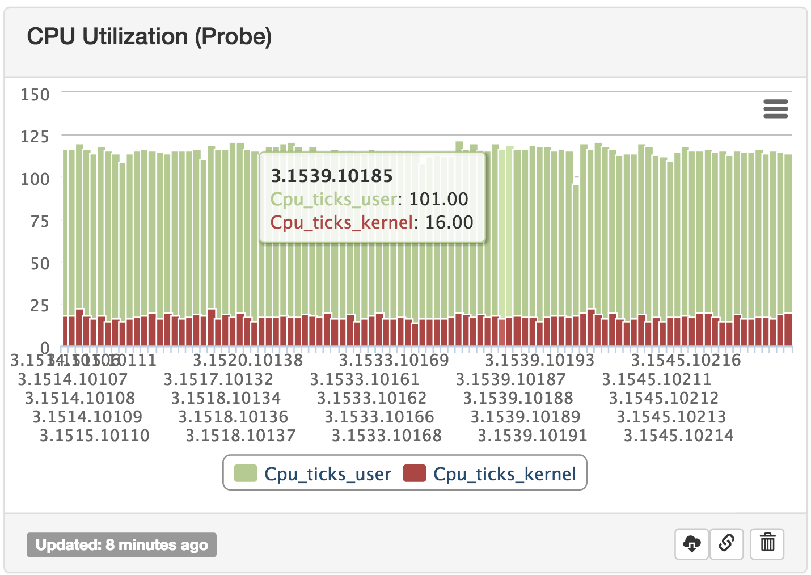
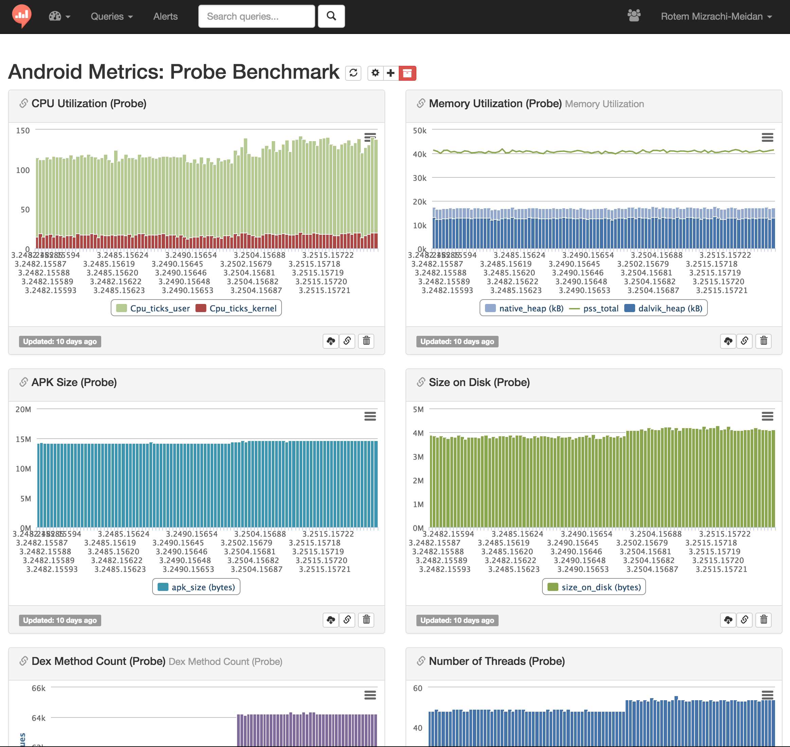

# Probe

Android applications performance testing tool.


##Background
In EverythingMe we used to have "performance blitzs" every now and then, when we (subjectivly) felt EverythingMe's launcher performance is not on par with what we would expect it to be. Then we would start manually measuring the app's vital signs using the following tools: 

* **Memory utilization** - Dalvik, Native, PSS total:

	```bash
	adb shell dumpsys meminfo app.package.name
	```
* **CPU utilization** - this one is tricky, you can certainly measure it with `top`, but in order to calculate "how much processing power was needed to complete the task you'd need to sum up the instantaneous CPU usage for the entire duration of the measurement. Instead, I chose to measure CPU ticks using data from proc stat

	```bash
	cat proc/{pid}/stat
	```
	
* **Disk usage** - well, a simple `du` covers it

	```bash
	du -s /data/data/{package_name}
	```
* **Thread count** - using `top` (#THR column) 
* **a lot more** - with Android Studio's new(ish) tools, MAT and numerous logcat logs.


You are probably familiar with the huge amount of repetative work when doing such measurements and even though this is a tedious process, the collected results worth nothing without a comparison to previous measurements. This is where `probe` gets in the picture.

probe is desigend to measure these vital signs mentioned above (and much more), as a cli tool or as a python module.

##How does it work
 
Probe is designed to measure everything* automatically, and by everything I mean anything that has a logcat output or which can be queried using adb (dumpsys, dumpheap, profile, etc.) or a linux command (du, cat, top, etc.)

Each measurer registers to a certain registar, and the latter in turn triggers that measurer to do something.

There are three types of registrars:

##Registrars

Registars are metaclasses. when a class's metaclass is being set to be a registrar, it is automatically being registered to start/stop events and logcat output events.

**SnapshotRegistrar**:  *more here soon*

**ContinuousRegistrar**: *more here soon*

**GlobalRegistrar**: *more here soon*
 
##Measurers

The actual code which collects the data is written here.

**Snapshot measurers**: When probe is triggered to stop measuring, it begins collecting data from all measurers registered to `SnapshotRegistrar`. It may get an instantaneous value of a measurer (current memory utilization, number of threads, CPU ticks, etc.)

**Continuous measurers**:  When probe starts, it triggers an `adb logcat` instance. This instance output is being passed line by line to all measurers which registered to the `ContinuousRegistrar`. Each measurer filters relevant logcat lines using `is_matching(line)` function, and processes then in `process(line)`. The measurer handles its own state machine (whether its a simple line counter which only measures the amount of processed lines, or a more complicated one measuring the frequency of `GC_FOR_ALLOC` lines).

**Global measurers**: A combination of both, a Continuous measurer, receiving relevant logcat lines, processing them (either just counting occurrences of this logcat line, or triggering a small state machine in it). the registar then takes a snapshot of what it accumulated when probe triggers it to stop.
 
 
 
* **Writing new measurers**: 

 This is how a measurer looks like:
 
	```python       
	class CpuTicksUser(object):
	   """
	   Cpu usage - user space (in ticks)
	   """
	   PROC_STAT_USER_TICKS_LOC = 13
	   
	   __metaclass__ = SnapshotRegistrar
	
	   def __init__(self):
	       pass
	
	   def name(self):
	   """
	   the key of this measurement in the output dict 
	   """
	       return 'cpu_ticks_user'
	
	   def value(self):
	   """
	   the value of this measurement in the output dict 
	   """
	   		pid = runtime.get_instance().get_pid()
	   		procstat = adb.get_instance().shell('cat /proc/%s/stat' % pid)['stdout'][0].split()
	   		return int(procstat[PROC_STAT_USER_TICKS_LOC])    
	```


## Querying probe's DB 
Probe writes output to a provided DB (or a local sql lite (mydatabase.db) if no connection string is provided.

querying probe's db for `cpu_ticks` (both user and kernel ticks) values in last 100 builds:

```sql
SELECT p.Build_number, version_code, Cpu_ticks_user, Cpu_ticks_kernel FROM collector p
JOIN ((SELECT Build_number, max(Created_at) as max_time
FROM collector
GROUP BY Build_number)) m ON (p.Build_number=m.Build_number and p.created_at=m.max_time)
ORDER BY p.Build_number desc
LIMIT 100
```


And that's how it looks like in [redash](https://github.com/getredash/redash): 


## Important note
**It is important to emphesize that probe is a benchmark to itself! meaning it needs to run consecutively on the same device in order to produce valid results (of course SGS4 would have a higher PSS total value than SGS3, it has 225% the pixle count of SGS3).**

##Some more graphs 
or "this is what we measured on EverythingMe Launcher"
